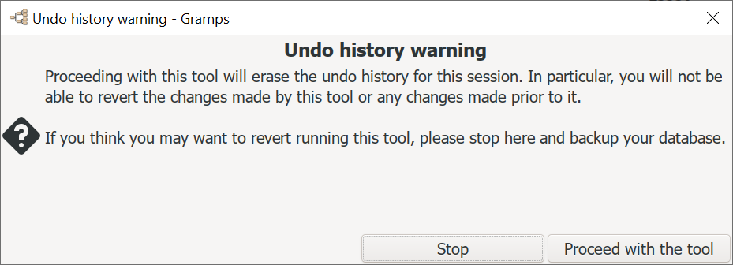
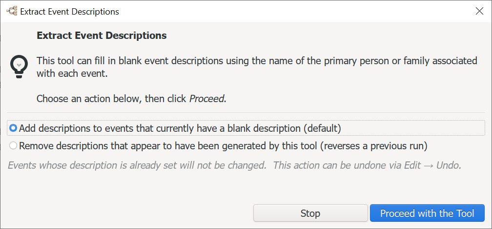
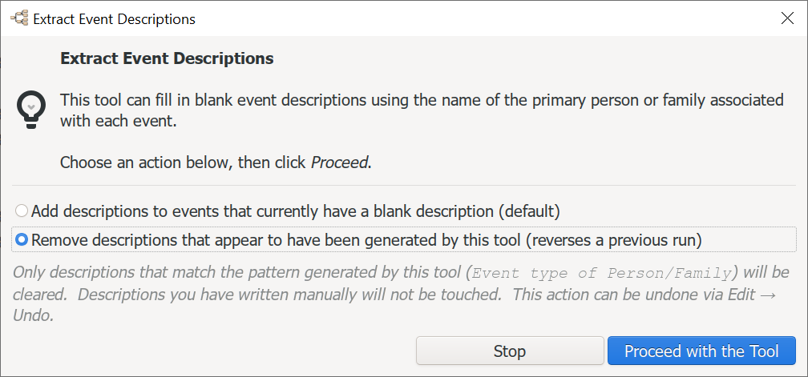
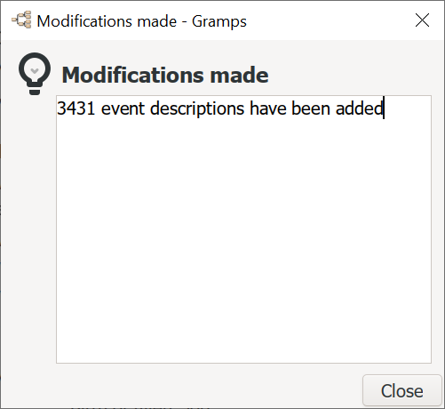

Original [`gramps/plugins/tool/eventnames.py`](https://github.com/gramps-project/gramps/blob/maintenance/gramps60/gramps/plugins/tool/eventnames.py) is less useful than when it was originally created. Descriptions no longer need to be explicit because the expanded GUI gives similar feedback. Explicit descriptions just add clutter to the database and Web reports.  

The [Example.gramps](https://gramps-project.org/wiki/index.php/Example.gramps) sample tree is a good example of this clutter. (It contains over 3,000 redundant descriptions.)

This replacement must be manually installed. During testing, recommend renaming the original `eventnames.py` file rather than overwriting it.

## Enhancements 

Add pre-run dialog with Add/Remove modes to Extract Event Descriptions tool.

The existing undo-history warning dialog provided no useful context and was too easy to dismiss accidentally when the tool was not intended to be run.  This change replaces it with a purpose-built EventNamesDialog offering two clearly labelled radio options:
* Add descriptions to events with blank descriptions (original behaviour,     selected by default).
* Remove descriptions that match the auto-generated pattern, reversing a     previous run without touching manually-authored descriptions.

A Stop button exits cleanly before any database transaction is opened.

#### Generated-by: Claude Sonnet 4.6, Anthropic (claude-sonnet-4-6) 
*Prompt:* "develop a new dialog to supplant the Undo history warning dialog with Stop and Proceed buttons that provides a reciprocal option to clear any description that matches what the Tool might have added previously"

### New class: `EventNamesDialog`

This *(fails to) replace* the role previously played by the bare "Undo history warning" that `BatchTool.__init__` fires automatically. 

 
By wiring the dialog into `_show_dialog_and_run()` — which is called **after** `BatchTool.__init__` completes but before any database work begins — the user sees a purposeful, tool-specific dialog instead of a generic alarm.

The dialog contains:

| UI element | Purpose |
|---|---|
| Information icon + explanation label | Explains what the tool does so accidental triggering is obvious |
| **Add** radio (default, pre-selected) | Preserves original behaviour — fills blank descriptions |
| **Remove** radio | Reverses a prior run — the new reciprocal action |
| Dynamic hint label (`dim-label`) | Updates live to explain exactly what each mode will and won't touch |
| **Stop** button (`CANCEL`) | Safe exit with no changes, no undo history pollution |
| **Proceed with the Tool** button (`suggested-action`) | GTK accent styling makes the intentional path clear |

### New mode: `MODE_REMOVE` / `_run_remove()`

The remove pass re-derives the exact string that `person_event_name` / `family_event_name` *would* produce for each event's current primary person or family, then compares it to the stored description. Only an exact match triggers a clear. This means:

- Descriptions the user wrote themselves (even if they happen to contain the event type name) are safe unless they match the template character-for-character.
- The same `EVENT_PERSON_STR` / `EVENT_FAMILY_STR` module-level format strings are reused in `_matches_person_pattern` and `_matches_family_pattern`, so any future localisation change automatically keeps Add and Remove in sync.

### `EventNames.__init__` restructure

`_show_dialog_and_run()` captures the parent window once, builds the dialog, reads the chosen mode, destroys the dialog, and dispatches to `_run_add` or `_run_remove`. If the user clicks **Stop**, the method returns immediately — the undo stack is never touched.

### Statistics feedback

## Future improvements

* Eliminate the redundant original "Bail Out" dialog
* Progress bar feedback
* Improve contextual comment for each option. Include example of an 'extracted' descrption
* add an Event filtering option
* Rename Tool (Since "Extract" was originally inaccruate. And moreso now that there is a Remove option)
* Add note that Undo History will exceed the maximum so Undo is disabled. (Backup before proceeding. Could be an intellingent Backup message? If database is not dirty since last backup, no backup should be suggested.)
* Add override for Preferences -> Data -> Name Format ("Call Last Suffix" might be more natural than GUI default format of "Last,First")  
